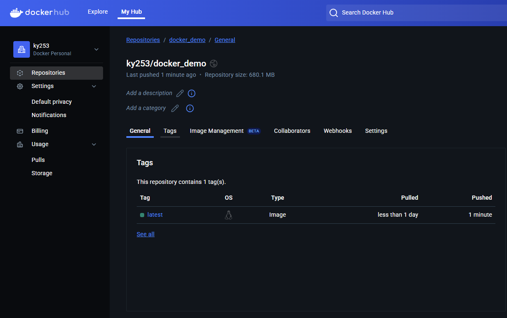

# Docker Demo Project

This project demonstrates a simple Docker containerization workflow with GitHub Actions CI/CD pipeline.

## GitHub Actions Workflow Status

## Project Structure
- `main.py`: Main application file
- `Dockerfile`: Docker container configuration
- `requirements.txt`: Python dependencies
- `.github/workflows/docker.yml`: GitHub Actions workflow configuration

## Getting Started
1. Clone the repository
2. Build the Docker image: `docker build -t docker_demo .`
3. Run the container: `docker run docker_demo`
